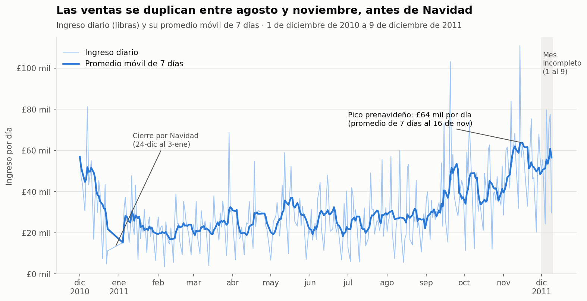
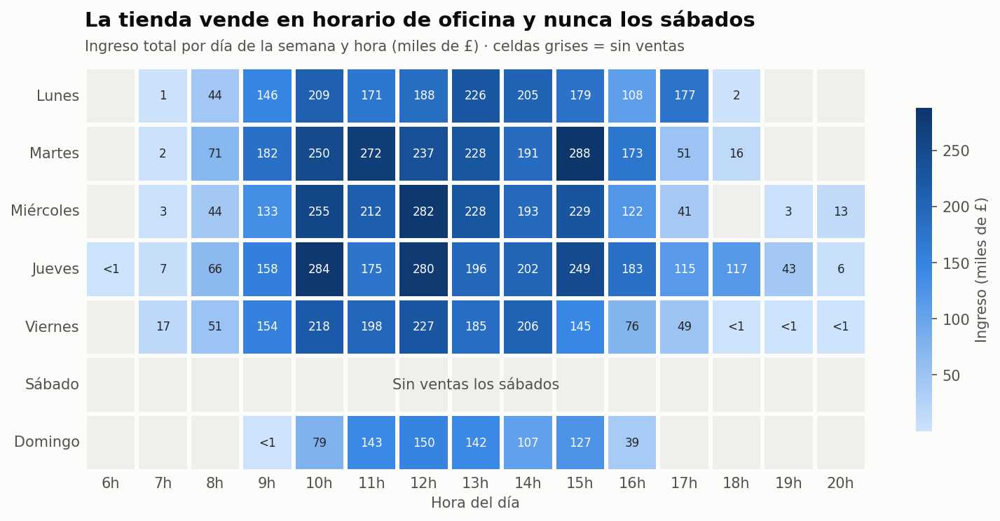
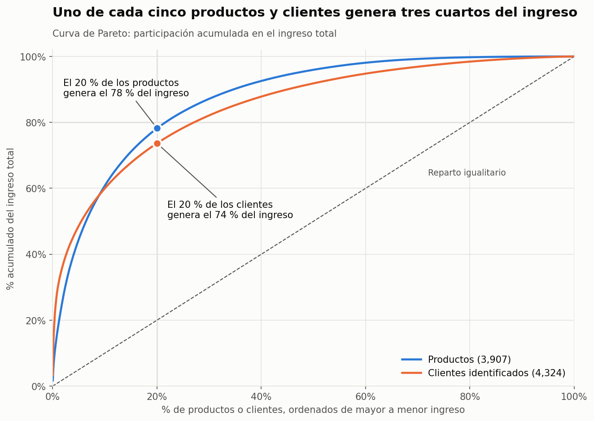

# Taller 01: Adquisición, procesamiento y visualización de datos

**Maestría en Ciencia de Datos · Universidad Yachay Tech**
**Asignatura:** Fundamentos de Ciencia de Datos
**Autor:** Alexander Omar Fernández Pérez

Análisis completo del dataset **Online Retail** (UCI Machine Learning Repository): desde la descarga de los datos crudos hasta su limpieza, almacenamiento en SQLite, análisis exploratorio y visualización.

---

## 📦 Dataset

| | |
|---|---|
| **Fuente** | [UCI Machine Learning Repository, Online Retail (id 352)](https://archive.ics.uci.edu/dataset/352/online+retail) |
| **Contenido** | Todas las transacciones de una tienda online del Reino Unido |
| **Periodo** | 01/12/2010 al 09/12/2011 |
| **Tamaño original** | 541.909 filas × 8 columnas |
| **Unidad de observación** | Una línea de producto dentro de una factura |

---

## 🧹 Parte 1: Adquisición y limpieza de datos

- **Adquisición:** descarga automática del dataset con `requests` y lectura del Excel con `pandas`.
- **Diagnóstico:** revisión de tipos, valores faltantes, estadísticas y cuantificación de cada problema antes de limpiar.
- **Limpieza en 7 decisiones**, cada una justificada con evidencia:

| # | Decisión | Filas eliminadas |
|---|---|---|
| 1 | Duplicados exactos | 5.268 |
| 2 | Cancelaciones (facturas con "C"): se **separan** en su propia tabla | 9.251 |
| 3 | Compras anuladas por completo por una cancelación | 2.853 |
| 3b | Compra anulada con un ajuste manual (error de digitación) | 1 |
| 4 | Ajustes de inventario (cantidad negativa, sin cliente ni precio) | 1.336 |
| 5 | Precios ≤ 0 (muestras y ajustes contables por deudas incobrables) | 1.176 |
| 6 | Códigos que no son productos (envíos, comisiones, ajustes manuales) | 2.250 |
| 7 | Corrección de tipos y columnas derivadas (`QuantityCanceled`, `QuantityNet`, `TotalPrice`) | — |

**Resultado:** 519.774 ventas limpias (95,9 % del original).

- **Almacenamiento:** carga de los datos limpios en **SQLite** (`online_retail.db`) con dos tablas, `ventas` y `cancelaciones`, verificadas con consultas SQL.

---

## 🔍 Parte 2: Análisis exploratorio (EDA)

- **Lectura desde SQLite** a DataFrames de `pandas`.
- **Descripción campo por campo** de las 11 columnas.
- **Metadatos:** diccionario de datos (CSV y tabla `metadatos` en SQLite) y ficha del dataset en JSON (fuente, cobertura, calidad y linaje del procesamiento).
- **Descripción del dataset** en archivo de texto (`descripcion_dataset.txt`).

**Hallazgos principales:**

- 19.646 facturas, 4.324 clientes identificados, 3.907 productos y 38 países
- Reino Unido concentra el 92 % de las líneas y el 85 % del ingreso.
- No hay ventas los sábados, y las compras ocurren en horario de oficina.

---

## 📊 Parte 3: Visualización

| Gráfica | Técnica | La historia que cuenta |
|---|---|---|
|  | **Serie de tiempo** con promedio móvil de 7 días y anotaciones | El ingreso de noviembre duplica al de agosto: los mayoristas se abastecen antes de Navidad. |
|  | **Mapa de calor** día de la semana × hora | Se vende en horario de oficina (10:00–15:00) y nunca los sábados: son clientes empresariales. |
|  | **Curva de Pareto** | El 20 % de los productos genera el 78 % del ingreso y el 20 % de los clientes, el 74 %. |
| `viz_extra_mapa_paises.html` | **Mapa interactivo** (plotly) | Fuera del Reino Unido el mercado es europeo; Países Bajos e Irlanda venden más que Alemania o Francia con muy pocos clientes. |

---
